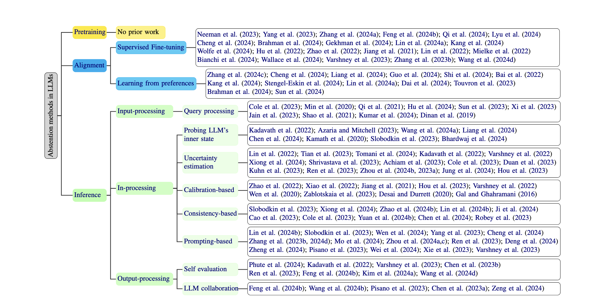

<!-- # The art of refusal: A survey of abstention in large language models -->
# Know Your Limits: A Survey of Abstention in Large Language Models
<!-- [](https://github.com/chenjux/abstention)
[](https://img.shields.io/github/stars/yuzhimanhua/Awesome-Scientific-Language-Models?style=social)

[](https://img.shields.io/badge/PaperNumber-266-blue)-->
[](https://opensource.org/licenses/MIT)
[](https://img.shields.io/badge/PRs-Welcome-red)

# Abstention Methods in LLMs

The repository is part of our survey paper [**Know Your Limits: A Survey of Abstention in Large Language Models**](https://arxiv.org/abs/2407.18418) and will be continuously updated.

**NOTE 1**:  

**NOTE 2**:  

**NOTE 3**: We appreciate contributions. If you have any suggested papers, feel free to reach out to [chenjux@uw.edu](mailto:chenjux@uw.edu).
<!--
## 1. Pretraining

## 2. Alignment
- **Instruction Tuning**
- **Learning from Preferences**

## 3. Inference

### Input-Processing
- **Query Processing**

### In-Processing
- **Probing LLM's Inner State**
- **Uncertainty Estimation**
- **Calibration-Based**
- **Consistency-Based**
- **Prompting-Based**

### Output-Processing
- **Self-Evaluation**
- **LLM Collaboration**-->


<p align="center">
    
</p>


## Contents
- [Pretraining](#pretraining)

- [Alignment](#alignment)
  - [Instruction Tuning](#alignment-instruction-tuning)
  - [Learning from Preferences](#alignment-learning-from-preferences)
- [Inference](#inference)
  - [Input-Processing](#inference-input-processing)
    - [Query Processing](#inference-query-processing)
  - [In-Processing](#inference-in-processing)
    - [Probing LLM’s inner state](#inference-probing-llms-inner-state)
    - [Uncertainty estimation](#inference-uncertainty-estimation)
    - [Calibration-Based](#inference-calibration-based)
    - [Consistency-Based](#inference-consistency-based)
    - [Prompting-Based](#inference-prompting-based)
  - [Output-Processing](#inference-output-processing)
    - [Self-Evaluation](#inference-self-evaluation)
    - [LLM Collaboration](#inference-llm-collaboration)


---

## Pretraining

## Alignment
<h3 id="alignment">Instruction Tuning</h3>

- **Alignment for Honesty**  
  **Conference**: NeurIPS 2024  
  [Paper](https://arxiv.org/abs/2312.07000) | [GitHub](https://github.com/GAIR-NLP/alignment-for-honesty)

- **R-tuning: Instructing Large Language Models to Say ‘I Don’t Know’**  

  **Conference**: NAACL 2024  
  [Paper](https://aclanthology.org/2024.naacl-long.394/) | [GitHub](https://github.com/shizhediao/R-Tuning)

- **Keeping LLMs Aligned After Fine-Tuning: The Crucial Role of Prompt Templates**  

  **Conference**: ICLR 2024 R2-FM Workshop Poster  
  [Paper](https://arxiv.org/abs/2402.18540)

- **The Instruction Hierarchy: Training LLMs to Prioritize Privileged Instructions**  

  **Conference**: --  
  [Paper](https://arxiv.org/abs/2404.13208)

- **Don’t Hallucinate, Abstain: Identifying LLM Knowledge Gaps via Multi-LLM Collaboration**  

  **Conference**: ACL 2024  
  [Paper](https://aclanthology.org/2024.acl-long.786.pdf) | [GitHub](https://github.com/BunsenFeng/AbstainQA)

- **Defending Large Language Models Against Jailbreaking Attacks Through Goal Prioritization**  

  **Conference**: ACL 2024  
  [Paper](https://aclanthology.org/2024.acl-long.481/) | [GitHub](https://github.com/thu-coai/JailbreakDefense_GoalPriority)

- **The Art of Saying No: Contextual Noncompliance in Language Models**  

  **Conference**: NeurIPS 2024 (Track: Datasets and Benchmarks Poster)  
  [Paper](https://www.arxiv.org/abs/2407.12043) | [GitHub](https://github.com/allenai/noncompliance)

- **Safety-Tuned LLaMAs: Lessons from Improving the Safety of Large Language Models That Follow Instructions**  

  **Conference**: ICLR 2024  
  [Paper](https://arxiv.org/abs/2309.07875) | [GitHub](https://github.com/vinid/safety-tuned-llamas)

- **The Art of Defending: A Systematic Evaluation and Analysis of LLM Defense Strategies on Safety and Over-Defensiveness**  

  **Conference**: ACL 2024  
  [Paper](https://aclanthology.org/2024.findings-acl.776/)
  
---

<h3 id="alignment-learning-from-preferences">Learning from Preferences</h3>


- **Self-alignment for factuality**  

  **Conference**: ACL 2024  
  [Paper](https://arxiv.org/abs/2402.09267) | [GitHub](https://github.com/zhangxy-2019/Self-Alignment-for-Factuality)

- **Can AI assistants know what they don’t know?**  
 
  **Conference**: ICML 2024 (Poster)  
  [Paper](https://arxiv.org/pdf/2401.13275) | [GitHub](https://github.com/OpenMOSS/Say-I-Dont-Know)

- **Learning to trust your feelings**  

  **Conference**: ACL 2024  
  [Paper](https://arxiv.org/abs/2401.15449) | [GitHub](https://github.com/liangyuxin42/dreamcatcher)

- **Controllable preference optimization**  
  _Toward controllable multi-objective alignment._  
  **Conference**: EMNLP 2024  
  [Paper](https://aclanthology.org/2024.emnlp-main.85.pdf) | [GitHub](https://github.com/OpenBMB/CPO)

- **SafeRLHF**  
  _Safe reinforcement learning from human feedback._  
  **Conference**: ICLR 2024  
  [Paper](https://arxiv.org/pdf/2310.12773) | [GitHub](https://github.com/PKU-Alignment/safe-rlhf)

- **Training a helpful and harmless assistant with reinforcement learning from human feedback**  
  _Exploring the safe design of AI assistants._  
  **Conference**: ICLR 2024  
  [Paper](https://arxiv.org/abs/2310.12773) | [GitHub](https://github.com/PKU-Alignment/safe-rlhf)

- **Flame: Factuality-aware alignment for large language models**  
  _Addressing factuality in large language models._  
  **Conference**: NeurIPS 2024  
  [Paper](https://arxiv.org/abs/2405.01525) | [GitHub](https://github.com/Flame/Alignment)

- **Safe RLHF**  
  _Safe reinforcement learning from human feedback._  
  **Conference**: ICLR 2024  
  [Paper](https://arxiv.org/abs/2310.12773) | [GitHub](https://github.com/PKU-Alignment/safe-rlhf)

- **LLaMA: Open and efficient foundation language models**  
  _Designing open and efficient foundation models._  
  **Conference**: N/A  
  [Paper](https://arxiv.org/abs/2302.13971) | [GitHub](https://github.com/meta-llama/llama)

- **The art of saying no**  
  _Contextual noncompliance in language models._  
  **Conference**: NeurIPS 2024  
  [Paper](https://www.arxiv.org/abs/2407.12043) | [GitHub](https://github.com/allenai/noncompliance)

- **Defending against backdoor attacks in natural language generation**  
  _Addressing backdoor attacks in natural language models._  
  **Conference**: N/A  
  [Paper](https://arxiv.org/abs/2106.01810) | [GitHub](https://github.com/defend-backdoor-attacks)

- **Break the breakout**  
  _Reinventing LM defense against jailbreak attacks with self-refinement._  
  **Conference**: AAAI-23  
  [Paper](https://tianweiz07.github.io/Papers/23-aaai.pdf) | [GitHub](https://github.com/self-refinement-defense)

---

## Inference


<h3 id="inference-input-processing">Input-Processing</h3>
<h4 id="inference-query-processing">Query Processing</h4>

- **Selectively answering ambiguous questions**  
  _Designing models to handle ambiguity in natural language understanding._  
  **Conference**: EMNLP 2023  
  [Paper](https://arxiv.org/abs/2305.14613)  

- **ONION: A simple and effective defense against textual backdoor attacks**  
  _A method to defend against textual backdoor attacks in NLP models._  
  **Conference**: EMNLP 2021  
  [Paper](https://aclanthology.org/2021.emnlp-main.752.pdf) | [GitHub](https://github.com/thunlp/ONION)

- **Token-level adversarial prompt detection based on perplexity measures and contextual information**  
  _Detecting adversarial prompts by analyzing token-level perplexity and context._  
  **Conference**: N/A  
  [Paper](https://arxiv.org/abs/2311.11509)

- **Defending against backdoor attacks in natural language generation**  
  _Addressing security issues in natural language generation models._  
  **Conference**: AAAI 2023  
  [Paper](https://arxiv.org/abs/2106.01810)

- **Defending pre-trained language models as few-shot learners against backdoor attacks**  
  _Protection strategies for pre-trained models against backdoor threats in few-shot settings._  
  **Conference**: NeurIPS 2023  
  [Paper](https://arxiv.org/abs/2309.13256) | [GitHub](https://github.com/zhaohan-xi/PLM-prompt-defense)

- **Baseline defenses for adversarial attacks against aligned language models**  
  _Establishing baseline strategies for defending aligned language models from adversarial attacks._  
  **Conference**: N/A  
  [Paper](https://arxiv.org/abs/2309.00614)

- **Bddr: An effective defense against textual backdoor attacks**  
  _A defense mechanism for protecting NLP models from textual backdoor attacks._  
  **Conference**: N/A  
  [Paper](https://dl.acm.org/doi/abs/10.1016/j.cose.2021.102433)

- **Certifying LLM safety against adversarial prompting**  
  _Methods for certifying the safety of large language models against adversarial prompts._  
  **Conference**: N/A  
  [Paper](https://arxiv.org/abs/2309.02705)

- **Build it break it fix it for dialogue safety: Robustness from adversarial human attack**  
  _Improving dialogue model safety by simulating adversarial human attacks._  
  **Conference**: EMNLP 2019  
  [Paper](https://arxiv.org/abs/1908.06083)

---


<h3 id="inference-in-processing">In-Processing</h3>
<h4 id="inference-probing-llms-inner-state">Probing LLM’s inner state</h4>

- **Language models (mostly) know what they know**  
  _Exploring the self-awareness of language models and their ability to recognize their own knowledge._  
  **Conference**: N/A  
  [Paper](https://arxiv.org/pdf/2207.05221)

- **The internal state of an LLM knows when it’s lying**  
  _How the internal state of LLMs can be used to detect dishonesty._  
  **Conference**: EMNLP 2023  
  [Paper](https://arxiv.org/abs/2304.13734)

- **Inferaligner: Inference-time alignment for harmlessness through cross-model guidance**  
  _Aligning models during inference for safe and harmless outcomes through cross-model interactions._  
  **Conference**: ACL 2024  
  [Paper](https://arxiv.org/abs/2401.11206) | [GitHub](https://github.com/Jihuai-wpy/InferAligner)

- **Simple and principled uncertainty estimation with deterministic deep learning via distance awareness**  
  _An approach for uncertainty estimation in deep learning models using distance awareness._  
  **Conference**: NeurIPS 2020  
  [Paper](https://arxiv.org/abs/2006.10108) | [GitHub](https://github.com/google/uncertainty-baselines/tree/master/baselines)

- **INSIDE: LLMs’ internal states retain the power of hallucination detection**  
  _Harnessing the internal states of LLMs to detect hallucinations during language generation._  
  **Conference**: ICLR 2024  
  [Paper](https://arxiv.org/abs/2402.03744) | [GitHub](https://github.com/alibaba/eigenscore)

- **Selective question answering under domain shift**  
  _Improving question answering models’ ability to adapt to shifts in domain._  
  **Conference**: ACL 2020  
  [Paper](https://arxiv.org/abs/2006.09462)

- **The curious case of hallucinatory (un)answerability: Finding truths in the hidden states of overconfident large language models**  
  _Exploring the hidden states of LLMs to uncover truths and reduce hallucinatory responses._  
  **Conference**: EMNLP 2023  
  [Paper](https://arxiv.org/abs/2310.11877) | [GitHub](https://github.com/lovodkin93/unanswerability)

- **Language models are Homer Simpson! Safety re-alignment of fine-tuned language models through task arithmetic**  
  _Re-aligning fine-tuned language models by adjusting task-specific arithmetic to enhance safety._  
  **Conference**: ACL 2024  
  [Paper](https://arxiv.org/abs/2402.11746) | [GitHub](https://github.com/declare-lab/resta)

---

<h4 id="inference-uncertainty-estimation">Uncertainty estimation</h4>

- **Teaching models to express their uncertainty in words**  
  _A study on how language models can be taught to express uncertainty in natural language._  
  **Conference**: TMLR  
  [Paper](https://arxiv.org/abs/2205.14334)

- **Just ask for calibration: Strategies for eliciting calibrated confidence scores from language models finetuned with human feedback**  
  _Exploring strategies to elicit calibrated confidence scores from language models fine-tuned with human feedback._  
  **Conference**: EMNLP 2023  
  [Paper](https://arxiv.org/abs/2305.14975)

- **Uncertainty-based abstention in LLMs improves safety and reduces hallucinations**  
  _A method to improve the safety and reliability of language models by enabling uncertainty-based abstention._  
  **Conference**: N/A  
  [Paper](https://arxiv.org/abs/2404.10960)

- **Language models (mostly) know what they know**  
  _Exploring the self-awareness of language models and their ability to recognize their own knowledge._  
  **Conference**: N/A  
  [Paper](https://arxiv.org/pdf/2207.05221)

- **Shifting attention to relevance: Towards the uncertainty estimation of large language models**  
  _Focusing on the relevance aspect in uncertainty estimation for large language models._  
  **Conference**: ACL 2024  
  [Paper](https://arxiv.org/abs/2307.01379) | [GitHub](https://github.com/jinhaoduan/SAR)

- **Can LLMs express their uncertainty? An empirical evaluation of confidence elicitation in LLMs**  
  _An empirical evaluation of how language models can express their uncertainty and confidence._  
  **Conference**: ICLR 2024  
  [Paper](https://arxiv.org/abs/2306.13063) | [GitHub](https://github.com/MiaoXiong2320/llm-uncertainty)

- **LLaMAs know what GPTs don’t show: Surrogate models for confidence estimation**  
  _An exploration of surrogate models for estimating confidence in language models like LLaMA and GPTs._  
  **Conference**: N/A  
  [Paper](https://arxiv.org/abs/2311.08877)

- **GPT-4 technical report**  
  _The technical report on the GPT-4 model, detailing its capabilities and innovations._  
  **Conference**: N/A  
  [Paper](https://arxiv.org/abs/2303.08774)

- **Selectively answering ambiguous questions**  
  _A study on how language models can selectively answer ambiguous questions with confidence._  
  **Conference**: EMNLP 2023  
  [Paper](https://arxiv.org/abs/2305.14613)

- **Semantic uncertainty: Linguistic invariances for uncertainty estimation in natural language generation**  
  _Focusing on semantic uncertainty and linguistic invariances to improve uncertainty estimation in natural language generation._  
  **Conference**: ICLR 2023  
  [Paper](https://arxiv.org/abs/2302.09664)

- **Self-evaluation improves selective generation in large language models**  
  _How self-evaluation can improve the ability of large language models to generate more selective and accurate outputs._  
  **Conference**: NeurIPS 2023 Workshops  
  [Paper](https://arxiv.org/abs/2312.09300)

- **Relying on the unreliable: The impact of language models’ reluctance to express uncertainty**  
  _Investigating the consequences of language models' reluctance to express uncertainty in their responses._  
  **Conference**: ACL 2024  
  [Paper](https://arxiv.org/abs/2401.06730)

<h4 id="inference-calibration-based">Calibration-Based</h4>

- **Calibrating sequence likelihood improves conditional language generation**  
  _Improving conditional language generation by calibrating sequence likelihood for better reliability._  
  **Conference**: ICLR 2023  
  [Paper](https://arxiv.org/abs/2210.00045)

- **Uncertainty quantification with pre-trained language models: A large-scale empirical analysis**  
  _An extensive empirical analysis of uncertainty quantification in pre-trained language models._  
  **Conference**: EMNLP 2022  
  [Paper](https://arxiv.org/abs/2210.04714)

- **How can we know when language models know? On the calibration of language models for question answering**  
  _Exploring methods to calibrate language models for improved performance in question answering._  
  **Conference**: TACL 2021  
  [Paper](https://arxiv.org/abs/2012.00955) | [GitHub](https://github.com/jzbjyb/lm-calibration)

- **Decomposing uncertainty for large language models through input clarification ensembling**  
  _Using input clarification ensembling to decompose uncertainty in large language models._  
  **Conference**: ICML 2024  
  [Paper](https://arxiv.org/abs/2311.08718) | [GitHub](https://github.com/UCSB-NLP-Chang/llm_uncertainty)

- **Investigating selective prediction approaches across several tasks in IID, OOD, and adversarial settings**  
  _Analyzing selective prediction approaches under various distribution settings for robustness._  
  **Conference**: ACL 2022  
  [Paper](https://arxiv.org/abs/2203.00211)

- **TyDi QA: A benchmark for information-seeking question answering in typologically diverse languages**  
  _Introducing TyDi QA, a benchmark designed for evaluating question answering in diverse languages._  
  **Conference**: TACL 2020  
  [Paper](https://arxiv.org/abs/2003.05002)

- **Reducing conversational agents’ overconfidence through linguistic calibration**  
  _Exploring linguistic calibration techniques to mitigate overconfidence in conversational agents._  
  **Conference**: TACL 2022  
  [Paper](https://arxiv.org/abs/2012.14983)

- **Learning confidence for transformer-based neural machine translation**  
  _Developing confidence learning mechanisms for neural machine translation models._  
  **Conference**: ACL 2022  
  [Paper](https://arxiv.org/abs/2203.11413) | [GitHub](https://github.com/yulu-dada/Learned-conf-NMT)

- **Batchensemble: An alternative approach to efficient ensemble and lifelong learning**  
  _Proposing BatchEnsemble for efficient ensemble methods and lifelong learning applications._  
  **Conference**: ICLR 2020  
  [Paper](https://arxiv.org/abs/2002.06715) | [GitHub](https://github.com/google/edward2)

- **On uncertainty calibration and selective generation in probabilistic neural summarization: A benchmark study**  
  _Benchmarking uncertainty calibration and selective generation for neural summarization tasks._  
  **Conference**: EMNLP 2023  
  [Paper](https://arxiv.org/abs/2304.08653)

- **Calibration of pre-trained transformers**  
  _A study on calibrating pre-trained transformers for improved reliability and performance._  
  **Conference**: EMNLP 2020  
  [Paper](https://arxiv.org/abs/2003.07892) | [GitHub](https://github.com/shreydesai/calibration)

- **LACIE: Listener-aware finetuning for confidence calibration in large language models**  
  _Introducing listener-aware finetuning to improve confidence calibration in language models._  
  **Conference**: N/A  
  [Paper](https://arxiv.org/abs/2405.21028) | [GitHub](https://github.com/esteng/pragmatic_calibration)
  
<h4 id="inference-consistency-based">Consistency-Based</h4>

- **The curious case of hallucinatory (un)answerability: Finding truths in the hidden states of overconfident large language models**  
  _Exploring the hidden states of overconfident LLMs to uncover hallucinatory (un)answerability._  
  **Conference**: EMNLP 2023  
  [Paper](https://arxiv.org/abs/2310.11877) | [GitHub](https://github.com/lovodkin93/unanswerability)

- **Can LLMs express their uncertainty? An empirical evaluation of confidence elicitation in LLMs**  
  _Evaluating the ability of large language models to express uncertainty effectively._  
  **Conference**: ICLR 2024  
  [Paper](https://arxiv.org/abs/2306.13063) | [GitHub](https://github.com/MiaoXiong2320/llm-uncertainty)

- **Knowing what LLMs DO NOT know: A simple yet effective self-detection method**  
  _Introducing a self-detection method for large language models to recognize unknowns._  
  **Conference**: ACL 2024  
  [Paper](https://arxiv.org/abs/2310.17918)

- **Generating with confidence: Uncertainty quantification for black-box large language models**  
  _Developing methods for uncertainty quantification in black-box large language models._  
  **Conference**: TMLR 2024  
  [Paper](https://arxiv.org/abs/2305.19187) | [GitHub](https://github.com/zlin7/UQ-NLG)

- **Defending large language models against jailbreak attacks via semantic smoothing**  
  _Using semantic smoothing techniques to protect LLMs against jailbreak attacks._  
  **Conference**: ICLR 2024  
  [Paper](https://arxiv.org/abs/2402.16192) | [GitHub](https://github.com/UCSB-NLP-Chang/SemanticSmooth)

- **Defending against alignment-breaking attacks via robustly aligned LLM**  
  _Proposing a robust alignment mechanism to counter alignment-breaking attacks._  
  **Conference**: ACL 2024  
  [Paper](https://arxiv.org/abs/2309.14348)

- **Selectively answering ambiguous questions**  
  _Developing strategies for selective answering to improve handling of ambiguous questions._  
  **Conference**: EMNLP 2023  
  [Paper](https://arxiv.org/abs/2305.14613)

- **RigorLLM: Resilient Guardrails for Large Language Models against Undesired Content**  
  _Introducing resilient guardrails to prevent undesired content generation in LLMs._  
  **Conference**: N/A  
  [Paper](https://arxiv.org/abs/2403.13031) | [GitHub](https://github.com/eurekayuan/RigorLLM)

- **INSIDE: LLMs’ internal states retain the power of hallucination detection**  
  _Leveraging LLMs' internal states for effective hallucination detection._  
  **Conference**: ICLR 2024  
  [Paper](https://arxiv.org/abs/2402.03744) | [GitHub](https://github.com/alibaba/eigenscore)

- **SmoothLLM: Defending large language models against jailbreaking attacks**  
  _Presenting SmoothLLM as a defense against jailbreak attacks for large language models._  
  **Conference**: N/A  
  [Paper](https://arxiv.org/abs/2310.03684) | [GitHub](https://github.com/arobey1/smooth-llm)
  
<h4 id="inference-prompting-based">Prompting-Based</h4>

- **Generating with confidence: Uncertainty quantification for black-box large language models**  
  _Developing methods to quantify uncertainty in black-box LLMs for improved confidence handling._  
  **Conference**: TMLR 2024  
  [Paper](https://arxiv.org/abs/2305.19187) | [GitHub](https://github.com/zlin7/UQ-NLG)

- **The curious case of hallucinatory (un)answerability: Finding truths in the hidden states of overconfident large language models**  
  _Exploring the hidden states of overconfident LLMs to address hallucinatory and unanswerable cases._  
  **Conference**: EMNLP 2023  
  [Paper](https://arxiv.org/abs/2310.11877) | [GitHub](https://github.com/lovodkin93/unanswerability)

- **Characterizing LLM abstention behavior in science QA with context perturbations**  
  _Analyzing how LLMs abstain from answering science questions under varying contexts._  
  **Conference**: N/A  
  [Paper](https://arxiv.org/abs/2404.12452) | [GitHub](https://github.com/bbwen/llm_scienceqa)

- **Alignment for honesty**  
  _Ensuring LLMs provide truthful responses by focusing on robust alignment strategies._  
  **Conference**: NeurIPS 2024  
  [Paper](https://arxiv.org/abs/2312.07000) | [GitHub](https://github.com/GAIR-NLP/alignment-for-honesty)

- **Can AI assistants know what they don’t know?**  
  _Proposing methods for AI assistants to recognize and admit their knowledge limitations._  
  **Conference**: ICML 2024 Poster  
  [Paper](https://arxiv.org/pdf/2401.13275) | [GitHub](https://github.com/OpenMOSS/Say-I-Dont-Know)

- **Defending large language models against jailbreaking attacks through goal prioritization**  
  _Employing goal prioritization to mitigate the effects of jailbreaking attacks on LLMs._  
  **Conference**: ACL 2024  
  [Paper](https://aclanthology.org/2024.acl-long.481/) | [GitHub](https://github.com/thu-coai/JailbreakDefense_GoalPriority)

- **Intention analysis makes LLMs a good jailbreak defender**  
  _Using intention analysis to safeguard LLMs against jailbreak attacks._  
  **Conference**: N/A  
  [Paper](https://arxiv.org/abs/2401.06561) | [GitHub](https://github.com/alphadl/SafeLLM_with_IntentionAnalysis)

- **Prompt-driven LLM safeguarding via directed representation optimization**  
  _Optimizing LLM representations to enhance defense mechanisms against adversarial prompts._  
  **Conference**: ICML 2024  
  [Paper](https://arxiv.org/abs/2401.18018) | [GitHub](https://github.com/chujiezheng/LLM-Safeguard)

- **Robust prompt optimization for defending language models against jailbreaking attacks**  
  _Improving prompt designs to safeguard LLMs from jailbreaking attempts._  
  **Conference**: ICLR 2024 Workshop  
  [Paper](https://arxiv.org/abs/2401.17263)

- **Defending jailbreak prompts via in-context adversarial game**  
  _A novel approach using adversarial games to defend against jailbreak prompts._  
  **Conference**: EMNLP 2024  
  [Paper](https://arxiv.org/abs/2402.13148)

- **Self-evaluation improves selective generation in large language models**  
  _Enhancing LLM generation quality by incorporating self-evaluation methods._  
  **Conference**: N/A  
  [Paper](https://arxiv.org/abs/2312.09300)

- **Fight back against jailbreaking via prompt adversarial tuning**  
  _Introducing Prompt Adversarial Tuning (PAT) as a defense against jailbreak attacks._  
  **Conference**: NeurIPS 2024  
  [Paper](https://arxiv.org/abs/2402.06255) | [GitHub](https://github.com/PKU-ML/PAT)

- **Bergeron: Combating adversarial attacks through a conscience-based alignment framework**  
  _Leveraging a conscience-based framework to align LLMs and defend against adversarial attacks._  
  **Conference**: N/A  
  [Paper](https://arxiv.org/abs/2312.00029) | [GitHub](https://github.com/matthew-pisano/Bergeron)

- **Jailbreak and guard aligned language models with only few in-context demonstrations**  
  _Using in-context demonstrations for defending aligned LLMs against jailbreak attacks._  
  **Conference**: N/A  
  [Paper](https://arxiv.org/abs/2310.06387) | [GitHub](https://adv-icl.github.io/)

- **Defending ChatGPT against jailbreak attack via self-reminders**  
  _Introducing self-reminder mechanisms to defend ChatGPT against jailbreak attempts._  
  **Conference**: Nature  
  [Paper](https://www.nature.com/articles/s42256-023-00765-8)

- **The art of defending: A systematic evaluation and analysis of LLM defense strategies on safety and over-defensiveness**  
  _Analyzing defense strategies to balance safety and performance in LLMs._  
  **Conference**: ACL 2024  
  [Paper](https://arxiv.org/abs/2401.00287)
---


<h3 id="inference-output-processing">Output-Processing</h3>
<h4 id="inference-self-evaluation">Self-Evaluation</h4>

- **LLM self defense: By self-examination, LLMs know they are being tricked**  
  _Introducing self-examination techniques to help LLMs recognize and defend against adversarial prompts._  
  **Conference**: N/A  
  [Paper](https://arxiv.org/abs/2308.07308)

- **Language models (mostly) know what they know**  
  _Exploring LLMs' capability to identify their knowledge limits and express uncertainty._  
  **Conference**: N/A  
  [Paper](https://arxiv.org/pdf/2207.05221)

- **The art of defending: A systematic evaluation and analysis of LLM defense strategies on safety and over-defensiveness**  
  _Evaluating defense strategies for LLMs to balance safety without excessive defensiveness._  
  **Conference**: ACL 2024  
  [Paper](https://aclanthology.org/2024.findings-acl.776/)

- **Adaptation with self-evaluation to improve selective prediction in LLMs**  
  _Enhancing LLM predictions by incorporating self-evaluation to refine selective responses._  
  **Conference**: EMNLP 2023  
  [Paper](https://arxiv.org/abs/2310.11689)

- **Self-evaluation improves selective generation in large language models**  
  _Improving LLM output quality through self-evaluation techniques during generation._  
  **Conference**: N/A  
  [Paper](https://arxiv.org/abs/2312.09300)

- **I could’ve asked that: Reformulating unanswerable questions**  
  _Transforming unanswerable questions into answerable forms to improve LLM reliability._  
  **Conference**: EMNLP 2024  
  [Paper](https://www.arxiv.org/abs/2407.17469) | [GitHub](https://github.com/wenting-zhao/couldask)
<h4 id="inference-llm-collaboration">LLM Collaboration</h4>


- **Reducing conversational agents’ overconfidence through linguistic calibration**  
  _Using linguistic calibration techniques to reduce overconfidence in conversational agents._  
  **Conference**: TACL 2022  
  [Paper](https://arxiv.org/abs/2012.14983)

- **SELF-GUARD: Empower the LLM to safeguard itself**  
  _A framework to enable LLMs to actively protect themselves against adversarial attacks._  
  **Conference**: NAACL 2024  
  [Paper](https://arxiv.org/abs/2310.15851)

- **Bergeron: Combating adversarial attacks through a conscience-based alignment framework**  
  _Introducing a conscience-based framework to enhance alignment and combat adversarial attacks._  
  **Conference**: N/A  
  [Paper](https://arxiv.org/abs/2312.00029) | [GitHub](https://github.com/matthew-pisano/Bergeron)

- **Jailbreaker in jail: Moving target defense for large language models**  
  _Proposing a moving target defense strategy to protect LLMs from jailbreaking attacks._  
  **Conference**: N/A  
  [Paper](https://arxiv.org/abs/2310.02417)

- **Don’t hallucinate, abstain: Identifying LLM knowledge gaps via Multi-LLM collaboration**  
  _Using collaboration between multiple LLMs to detect and abstain from providing hallucinated answers._  
  **Conference**: ACL 2024  
  [Paper](https://aclanthology.org/2024.acl-long.786.pdf) | [GitHub](https://github.com/BunsenFeng/AbstainQA)

- **Autodefense: Multi-agent LLM defense against jailbreak attacks**  
  _A multi-agent strategy for defending LLMs against jailbreak attacks using coordinated self-defense._  
  **Conference**: N/A  
  [Paper](https://arxiv.org/abs/2403.04783) | **Project**: SafeGenAi

## Citation
If you find this repository useful, please cite the following paper:
```
@article{wen2024know,
  title={Know Your Limits: A Survey of Abstention in Large Language Models},
  author={Wen, Bingbing and Yao, Jihan and Feng, Shangbin and Xu, Chenjun and Tsvetkov, Yulia and Howe, Bill and Wang, Lucy Lu},
  journal={arXiv preprint arXiv:2407.18418},
  year={2024}
}
```
